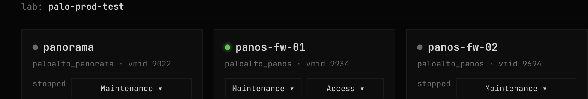
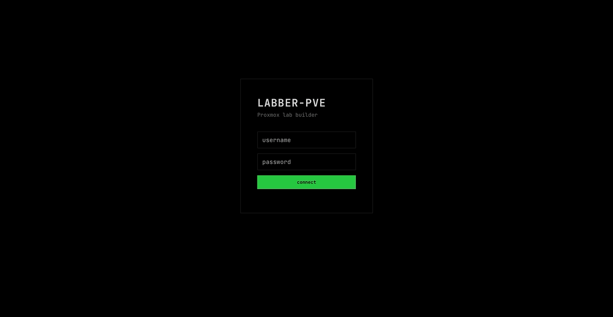
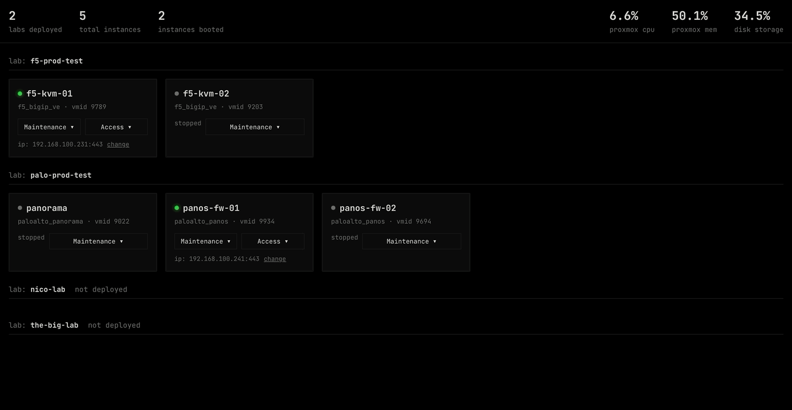
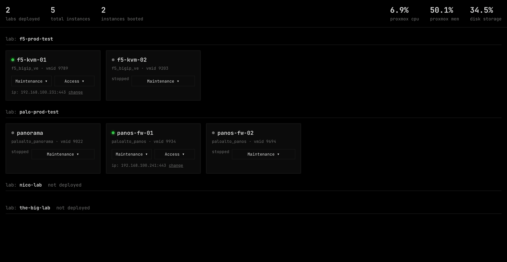
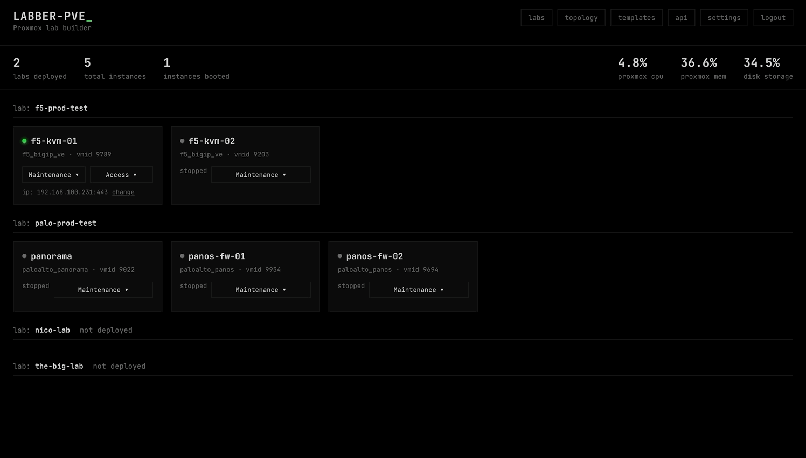
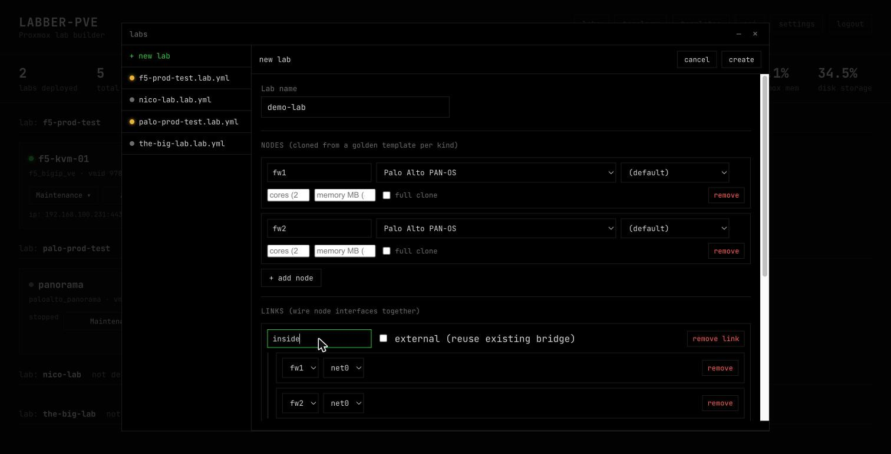
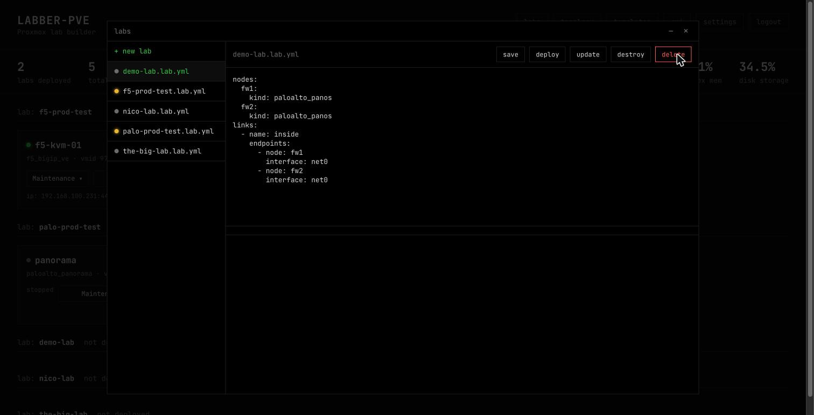

# labber-pve

A YAML-defined network/security lab builder for **Proxmox VE** — clone
golden VM templates (Palo Alto PAN-OS/Panorama, Check Point, F5, FortiOS,
Cisco, and more), wire them together with auto-provisioned Linux bridges,
and get a browser-based console + live status dashboard. Everything runs
through Proxmox's own REST API — no libvirt, no host socket mount, no
privileged container.

<p align="center">
  
</p>

## Why

- **Console access and per-VM status come from Proxmox itself** (its
  `termproxy`/`vncwebsocket` endpoints — the same ones its own web UI
  uses), not a custom noVNC/SSH bridge.
- **Cloning is Proxmox's own linked-clone feature**, not hand-managed
  qcow2 overlay files.
- **A plain HTTPS API client.** Runs anywhere with network access to
  your Proxmox node — Docker, Podman, k3s/k8s, or OpenShift — without
  being tied to the hypervisor itself.
- **Build templates straight from the browser.** Upload a vendor's
  qcow2/raw/vmdk (or ISO) and the app builds + registers the Proxmox
  template for you, no SSH or host filesystem access needed.

## Demo

| | |
|---|---|
|  Single-user (or multi-user) session auth, then straight to the live dashboard |  `web rp` embeds a node's own real web UI in an iframe — here, F5 BIG-IP's TMUI |
|  Console access straight from Proxmox's own termproxy — no SSH, no separate VNC client |  Visualize any lab's wiring as a graph, generated straight from its YAML |
|  Build a topology from a form — pick node kinds, wire interfaces together |  Every lab is also just a YAML file, editable directly |
|  Reach a lab node's real management API through this app — for your own automation, not just the browser | |

## Quick start

Only two secrets are required to boot the app — everything else
(Proxmox connection, template VMIDs, disk storage) is configured
**after** first boot, from the in-app Settings page, and takes effect
immediately with no restart.

```bash
# 1. Generate the two required secrets
node -e "console.log(require('bcryptjs').hashSync('yourpassword', 10))"   # DASHBOARD_PASSWORD_HASH
node -e "console.log(require('crypto').randomBytes(32).toString('hex'))"  # SESSION_SECRET

# 2. Run it (Docker or Podman)
docker build -t labber-pve .
docker run -e DASHBOARD_PASSWORD_HASH=... -e SESSION_SECRET=... \
  -p 8080:8080 -v ./labs:/labs labber-pve
```

k3s/OpenShift: `kubectl apply -f k8s/pvc.yaml`, fill in
`k8s/secret-example.yaml` with real values and apply it as a Secret
(don't commit the filled-in version), then
`kubectl apply -f k8s/deployment.yaml`.

Then log in, open **Settings**, and fill in a Proxmox host + scoped API
token (see `.env.example` for the `pveum` commands to create one), a
disk storage, and golden template VMIDs for whichever device kinds
you'll use.

## Lab YAML schema

```yaml
nodes:
  panorama1:
    kind: paloalto_panorama   # must match a key in lib/vendor-profiles.js
  pa-fw1:
    kind: paloalto_panos
    cores: 8                  # optional -- overrides just this node's clone
    memory: 16384              # optional, MB
    full: true                  # optional -- full clone instead of linked clone

links:
  - name: mgmt
    external: true             # reuse an existing bridge instead of provisioning one
    bridge: vmbr0
    endpoints:
      - { node: panorama1, interface: net0 }
      - { node: pa-fw1, interface: net0 }

  - name: inside                # no `external:` -> auto-provisioned isolated bridge
    endpoints:
      - { node: pa-fw1, interface: net1 }
      - { node: pa-fw2, interface: net1 }
```

Any NIC a node has that isn't referenced by a link is left explicitly
disconnected at deploy time (see the wizard's "Interface map" panel for
a live preview before deploying). See `labs/pa-panorama-test.lab.yml`
for a full example, or use the **+ new lab** wizard instead of
hand-writing YAML.

## Reaching a node's web UI

Once a node has a management IP (auto-detected via the QEMU guest
agent where supported, or entered by hand on its dashboard card), two
options appear:

- **web ui** — opens `https://<ip>:<port>/` directly in a new tab. No
  further setup.
- **web rp** — embeds the same UI in an in-dashboard `<iframe>`.
  Requires one-time setup (a wildcard DNS record + reverse-proxy rule
  pointing at this app's second HTTP listener, `lib/gui-proxy.js`) —
  see [docs/ADVANCED.md](docs/ADVANCED.md#web-rp-setup) for the full
  walkthrough.

## Security model (read before exposing this to a network)

This app holds Proxmox API credentials and brokers access to lab
appliance management interfaces:

- **Every `/api/*` route, deploy/destroy, console, and websocket
  endpoints require a session** from a bcrypt-verified account.
  Failed logins are throttled per source IP.
- **The embedded-GUI reverse proxy (`web rp`) is deliberately
  unauthenticated** — it can't check a session, because the browser
  loads it from a different hostname than the dashboard's own cookie
  is scoped to. Anyone who can reach that port and resolve that
  hostname gets the appliance's own login page (not this app's data).
  Treat it like any other lab-management surface: internal network,
  VPN, or an authenticating reverse proxy in front of it. Leave the
  GUI domain setting empty and the listener never starts.
- **The optional stats API and automation relay are off by default**,
  each behind their own explicit opt-in (see
  [docs/ADVANCED.md](docs/ADVANCED.md)).
- **Credentials at rest** (Proxmox tokens, user password hashes, relay
  token hashes) live in `0600`/`0700`-permission JSON files, not
  encrypted, never echoed back to the browser once saved.
- **TLS to lab appliances is not verified** (`rejectUnauthorized:
  false`) — self-signed certs are the norm on appliance management
  interfaces.

## Further reading

- [docs/ADVANCED.md](docs/ADVANCED.md) — remote stats API, the
  automation relay, building templates from a qcow2/ISO, disk storage
  setup, and the full `web rp` walkthrough.
- [docs/ARCHITECTURE.md](docs/ARCHITECTURE.md) — module layout and
  known limitations.

## Portability (Docker / Podman / k3s / OpenShift)

The Dockerfile avoids assuming a fixed UID — OpenShift's default
restricted SCC runs containers as an arbitrary, cluster-assigned
non-root UID (always in group `0`). `chgrp -R 0` + `chmod -R g=u` on
the app and labs directories at build time is what makes that work,
not the `USER 1001` line itself (Docker/Podman/k3s honor it as-is;
OpenShift overrides it but keeps the group-writable permissions).
Config is entirely env-var driven for the same reason — maps
identically onto `docker run -e`, `podman run -e`, and k8s/OpenShift
Secrets.

## License

MIT — see [LICENSE](LICENSE).
